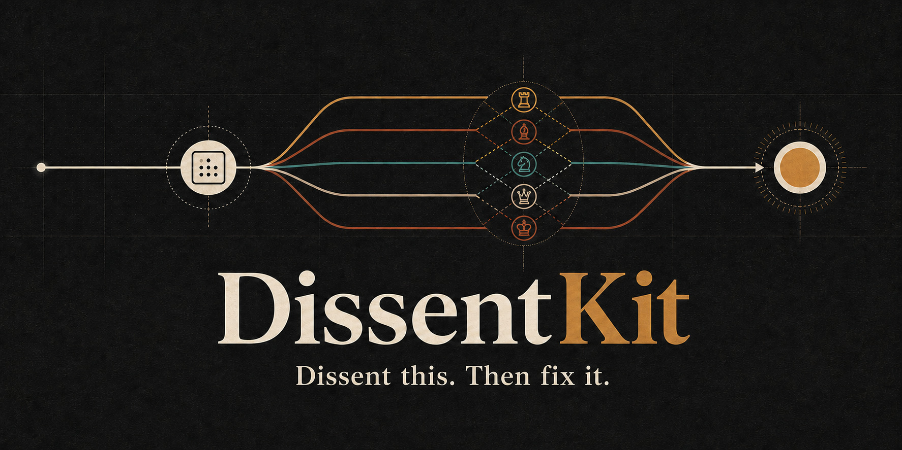
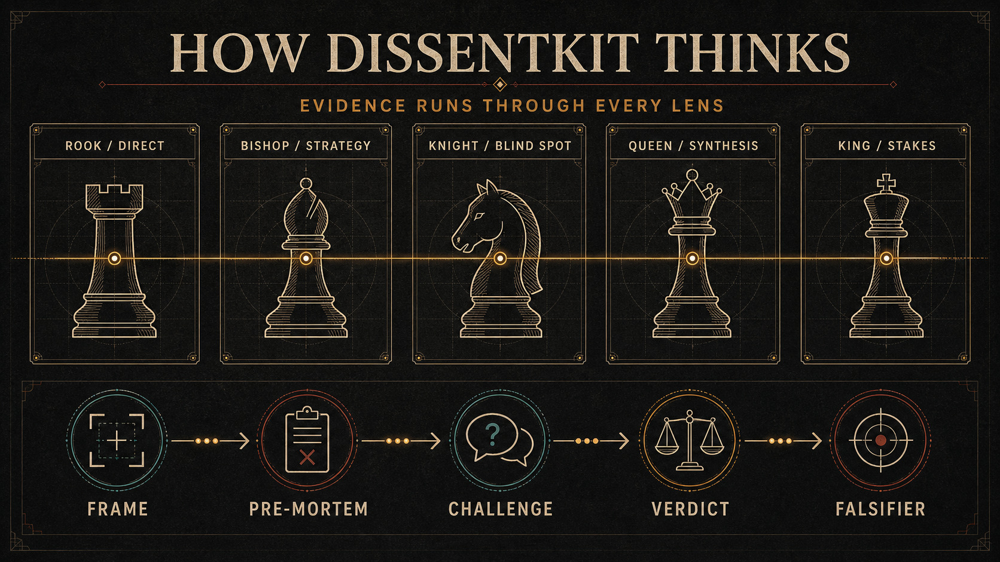

# DissentKit

[](https://github.com/bharath-blazecode/dissent-kit/actions/workflows/validate.yml)
[](LICENSE)




**Dissent this. Then fix it.**

DissentKit is an open agent skill for people who want a real second opinion. It gives ordinary work a direct, verdict-first review and reserves deeper deliberation for decisions that are expensive to get wrong.

It does not create five imaginary experts for every question. Most reviews need one clear answer. When the stakes justify more work, DissentKit adds defined lenses, challenge rounds, confidence tracking, and a concrete way to test the final recommendation later.

## See the difference

> **Request:** Dissent this: I want to launch the migration Friday without a rollback rehearsal.

A generic answer might say the launch is risky and suggest testing first. DissentKit makes the decision and the safer next step explicit:

> **Verdict:** Do not launch Friday without a rollback rehearsal. Functional migration tests do not prove that recovery works. Run a time-boxed rehearsal before the go or no-go decision, record the trigger, owner, commands, recovery time, and data-integrity check, and move the migration if the rehearsal fails.

This is an author-written illustration, not a benchmark result. Read [the full comparison](examples/quick-comparison.md), including the counterargument and missing tradeoff.

## Try it in 30 seconds

**No installation:** open [the universal prompt](platforms/universal/PROMPT.md), copy it into your assistant, and say `dissent this`.

**Codex:** paste this into a Codex task:

```text
$skill-installer Install DissentKit from https://github.com/bharath-blazecode/dissent-kit using the repository root, and name it dissent-kit.
```

**Supported coding agents:** if Node.js is installed, let the open [skills CLI](https://github.com/vercel-labs/skills) detect your agent:

```bash
npx skills add bharath-blazecode/dissent-kit
```

Confirm the installation with `npx skills list`. See [the installation guide](INSTALL.md) for updates, removal, release ZIPs, and manual platform setup.

## What it does

| Mode | Best for | Output |
| --- | --- | --- |
| Direct Review | Writing, plans, resumes, arguments, code review comments, reversible choices | Verdict, main risk, fair counterargument, missing tradeoff, corrected version |
| Deliberation | Material downside, lock-in, competing values, hard-to-reverse decisions | Pre-mortem, five analytical lenses, challenge round, confidence movement, unresolved issue, falsifier, review date |

Direct Review is the default. Deliberation runs only when the user asks for it or agrees that the decision warrants the extra work.

## The name and the call

**DissentKit** is the project name. **`dissent-kit`** is the skill ID.

The memorable call is:

```text
dissent this
```

People can also invoke `$dissent-kit` directly. For the deeper mode, use `dissent this deeply`, `run deliberation`, or `full dissent`.

The phrase matters more than forcing users to remember installation syntax. "Dissent this" is short, describes the action, and works in ordinary conversation.

## An honest limitation

A panel made from one model is not five independent sources.

On hosts with isolated subagents, DissentKit can run separate model passes. On other hosts, it uses the same five lenses inside one context. That still broadens coverage, but it does not turn correlated model output into independent evidence. DissentKit labels the difference instead of hiding it.

## The chess idea behind the lenses

The working names stay direct, but each one comes from a chess movement or responsibility:

| Chess cue | Working lens | Question |
| --- | --- | --- |
| Rook | Direct | What is the clearest failure case? |
| Bishop | Strategy | What happens one or two steps later? |
| Knight | Blind spot | What sits outside the obvious framing? |
| Queen | Synthesis | How do the arguments interact across the whole position? |
| King | Stakes | Which outcome must the decision protect? |

Evidence is not one seat at the table. It is the rule every seat follows. Each lens separates facts, inferences, assumptions, and unknowns.

The chess origin gives people a picture they can remember without turning the review into character role-play.



See [how DissentKit routes a request](docs/how-it-works.md) for the full pathway.

## Installation details

### Try it without installing

Open [the universal prompt](platforms/universal/PROMPT.md), copy its contents into your AI assistant, and say:

```text
dissent this
```

This gives you Direct Review and single-context Deliberation without changing files or settings.

### Install in Codex with one request

Open a Codex task and paste:

```text
$skill-installer Install DissentKit from https://github.com/bharath-blazecode/dissent-kit using the repository root, and name it dissent-kit.
```

The skill becomes available on the next turn. Invoke it as `$dissent-kit`, or say `dissent this`.

For manual setup and instructions for other assistants, see [the plain-language installation guide](INSTALL.md).

### Install with the cross-agent CLI

The public repository is discoverable as one skill named `dissent-kit`:

```bash
npx skills add bharath-blazecode/dissent-kit
```

The installer supports multiple coding agents and asks where and how to install the skill. It requires Node.js. Use the universal prompt if you do not want to install software.

### Codex and ChatGPT desktop

For personal use, place this repository at:

```text
~/.agents/skills/dissent-kit/
```

For one repository, place it at:

```text
<repo>/.agents/skills/dissent-kit/
```

Codex can invoke the skill explicitly as `$dissent-kit`, respond to `dissent this`, or select it when a request matches the description. See [the Codex adapter](platforms/codex/README.md) if you want repository-wide behavior instead.

### Claude Code

Copy the skill folder to `~/.claude/skills/dissent-kit/`. See [the Claude Code notes](platforms/claude-code/README.md).

### ChatGPT Custom GPT

If your ChatGPT account or workspace allows GPT creation, paste [the Custom GPT instructions](platforms/chatgpt/custom-gpt-instructions.md) into the GPT's Instructions field. Otherwise, use [the universal prompt](platforms/universal/PROMPT.md) in a regular conversation.

### Cursor

Copy [dissent-kit.mdc](platforms/cursor/.cursor/rules/dissent-kit.mdc) to `.cursor/rules/dissent-kit.mdc` in the target project.

### GitHub Copilot

Copy [copilot-instructions.md](platforms/copilot/copilot-instructions.md) to `.github/copilot-instructions.md`.

### Other assistants

Paste [the universal prompt](platforms/universal/PROMPT.md) at the start of a conversation.

## Platform behavior

| Platform | Direct Review | Deliberation | How Deliberation runs |
| --- | --- | --- | --- |
| Codex skill | Yes | Yes | Isolated passes when the host supports them; otherwise five lenses in one context |
| Codex `AGENTS.md` example | Yes | Yes | Five lenses in one context unless agent tools are available |
| Claude Code skill | Yes | Yes | Isolated passes when available; otherwise five lenses in one context |
| ChatGPT instructions | Yes | Yes | Five lenses in one context |
| Cursor rule | Yes | Yes | Five lenses in one context unless agent tools are available |
| GitHub Copilot | Yes | Yes | Five lenses in one context |
| Universal prompt | Yes | Yes | Five lenses in one context |

DissentKit always supports Direct Review and Deliberation. Some hosts can run the five lenses as isolated agent passes. Others run them sequentially in one conversation. The workflow remains available either way, but DissentKit does not describe a single-model review as independent consensus.

## Example

Start with [the quick comparison](examples/quick-comparison.md) to see what Direct Review adds to a generic answer. Then read [the worked review](examples/example-review.md) for the same decision in Direct Review and Deliberation modes.

## Evaluation

The repository includes contract fixtures for mode selection and response behavior. They do not claim that a prompt is objectively better by itself. They make the intended behavior inspectable and give contributors a stable set of cases to test.

Run the repository checks:

```bash
python scripts/check_repo.py
```

Read [evals/README.md](evals/README.md) to run the qualitative cases against a model or host.

The project does not publish a model pass rate without raw outputs and grading notes. [What the repository proves](docs/evidence.md) separates the checks available today from claims that still need testing.

## Build the small installation ZIP

Release maintainers can build a package containing only the core skill files:

```bash
python scripts/build_skill_package.py
```

The command creates a versioned ZIP and SHA-256 checksum in `dist/`. The archive extracts to a single `dissent-kit` folder that can be placed in a supported skills directory.

The archive includes `agents/openai.yaml`, which supplies DissentKit's display name, short description, brand color, default prompt, and implicit-invocation policy to OpenAI-compatible skill interfaces. It does not execute code or contact an external service.

## Origins

DissentKit combines and adapts two earlier MIT-licensed skills supplied by the project author: Reality-First Critic and Council. It does not claim their underlying review methods as new. The contribution here is the two-level routing, chess-derived functional lenses, honest execution labels, cross-platform packaging, examples, evaluation fixtures, and visual identity.

See [NOTICE.md](NOTICE.md) for the detailed provenance statement.

## Contributing

Bug reports should include the host, model, prompt, selected mode, output, and the behavior you expected. Pull requests that change the review contract should add or update a case in `evals/cases.json`.

If you are preparing the public release, [the launch kit](docs/launch-kit.md) contains the repository description, topics, release notes, social post, and launch checklist.

## License

MIT. See [LICENSE](LICENSE).
