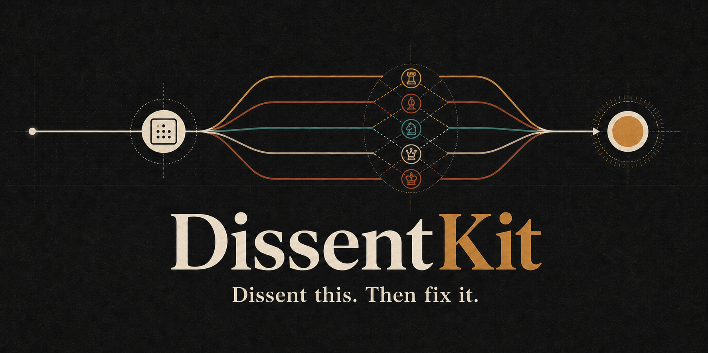
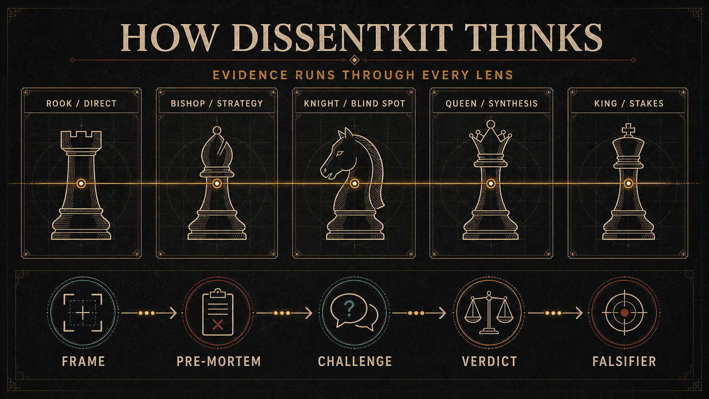

# DissentKit



**Dissent this. Then fix it.**

DissentKit is an open agent skill for people who want a real second opinion. It gives ordinary work a direct, verdict-first review and reserves deeper deliberation for decisions that are expensive to get wrong.

It does not create five imaginary experts for every question. Most reviews need one clear answer. When the stakes justify more work, DissentKit adds defined lenses, challenge rounds, confidence tracking, and a concrete way to test the final recommendation later.

## What it does

| Mode | Best for | Output |
| --- | --- | --- |
| Direct Review | Writing, plans, resumes, arguments, code review comments, reversible choices | Verdict, main risk, fair counterargument, missing tradeoff, corrected version |
| Deliberation | Material downside, lock-in, competing values, hard-to-reverse decisions | Pre-mortem, five analytical lenses, challenge round, confidence movement, unresolved issue, falsifier, review date |

Direct Review is the default. Deliberation runs only when the user asks for it or agrees that the decision warrants the extra work.

## The name and the call

**DissentKit** is the project name. **`dissent-kit`** is the skill ID.

The memorable call is:

```text
dissent this
```

People can also invoke `$dissent-kit` directly. For the deeper mode, use `dissent this deeply`, `run deliberation`, or `full dissent`.

The phrase matters more than forcing users to remember installation syntax. "Dissent this" is short, describes the action, and works in ordinary conversation.

## An honest limitation

A panel made from one model is not five independent sources.

On hosts with isolated subagents, DissentKit can run separate model passes. On other hosts, it uses the same five lenses inside one context. That still broadens coverage, but it does not turn correlated model output into independent evidence. DissentKit labels the difference instead of hiding it.

## The chess idea behind the lenses

The working names stay direct, but each one comes from a chess movement or responsibility:

| Chess cue | Working lens | Question |
| --- | --- | --- |
| Rook | Direct | What is the clearest failure case? |
| Bishop | Strategy | What happens one or two steps later? |
| Knight | Blind spot | What sits outside the obvious framing? |
| Queen | Synthesis | How do the arguments interact across the whole position? |
| King | Stakes | Which outcome must the decision protect? |

Evidence is not one seat at the table. It is the rule every seat follows. Each lens separates facts, inferences, assumptions, and unknowns.

The chess origin gives people a picture they can remember without turning the review into character role-play.



See [how DissentKit routes a request](docs/how-it-works.md) for the full pathway.

## Install

### Codex and ChatGPT desktop

For personal use, place this repository at:

```text
~/.agents/skills/dissent-kit/
```

For one repository, place it at:

```text
<repo>/.agents/skills/dissent-kit/
```

Codex can invoke the skill explicitly as `$dissent-kit`, respond to `dissent this`, or select it when a request matches the description. See [the Codex adapter](platforms/codex/README.md) if you want repository-wide behavior instead.

### Claude Code

Copy the skill folder to `~/.claude/skills/dissent-kit/`. See [the Claude Code notes](platforms/claude-code/README.md).

### ChatGPT Custom GPT

Paste [the Custom GPT instructions](platforms/chatgpt/custom-gpt-instructions.md) into the GPT's Instructions field.

### Cursor

Copy [dissent-kit.mdc](platforms/cursor/.cursor/rules/dissent-kit.mdc) to `.cursor/rules/dissent-kit.mdc` in the target project.

### GitHub Copilot

Copy [copilot-instructions.md](platforms/copilot/copilot-instructions.md) to `.github/copilot-instructions.md`.

### Other assistants

Paste [the universal prompt](platforms/universal/PROMPT.md) at the start of a conversation.

## Platform behavior

| Adapter | Direct Review | Deliberation | Isolated passes guaranteed? | Scope |
| --- | --- | --- | --- | --- |
| Open agent skill | Yes | Yes | Host dependent | Invoked or matched |
| Codex `AGENTS.md` example | Yes | Yes | No | Repository-wide |
| Claude Code skill | Yes | Yes | Host dependent | Invoked or matched |
| Custom GPT | Yes | Single-context | No | GPT-wide |
| Cursor rule | Yes | Single-context unless tools allow more | No | Rule-dependent |
| Copilot instructions | Yes | Single-context | No | Repository-wide |
| Universal prompt | Yes | Single-context | No | Conversation-wide |

## Example

See [the worked review](examples/example-review.md) for the same decision in Direct Review and Deliberation modes.

## Evaluation

The repository includes contract fixtures for mode selection and response behavior. They do not claim that a prompt is objectively better by itself. They make the intended behavior inspectable and give contributors a stable set of cases to test.

Run the repository checks:

```bash
python scripts/check_repo.py
```

Read [evals/README.md](evals/README.md) to run the qualitative cases against a model or host.

## Origins

DissentKit combines and adapts two earlier MIT-licensed skills supplied by the project author: Reality-First Critic and Council. It does not claim their underlying review methods as new. The contribution here is the two-level routing, chess-derived functional lenses, honest execution labels, cross-platform packaging, examples, evaluation fixtures, and visual identity.

See [NOTICE.md](NOTICE.md) for the detailed provenance statement.

## Contributing

Bug reports should include the host, model, prompt, selected mode, output, and the behavior you expected. Pull requests that change the review contract should add or update a case in `evals/cases.json`.

If you are preparing the public release, [the launch kit](docs/launch-kit.md) contains the repository description, topics, release notes, social post, and launch checklist.

## License

MIT. See [LICENSE](LICENSE).
