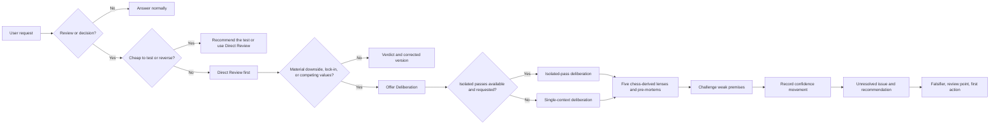

# How DissentKit routes a request

The routing keeps routine criticism short. It also prevents a simulated panel from being described as independent evidence.

The five lenses use chess as a mnemonic: Rook for Direct, Bishop for Strategy, Knight for Blind spot, Queen for Synthesis, and King for Stakes. Evidence runs through every lens.

## What the pathway protects

- Direct Review avoids spending a large context budget on a small edit.
- Deliberation begins with failure cases so each lens has something concrete to challenge.
- The execution label tells the reader whether separate model passes actually ran.
- The falsifier and review point make the recommendation testable after the decision.
